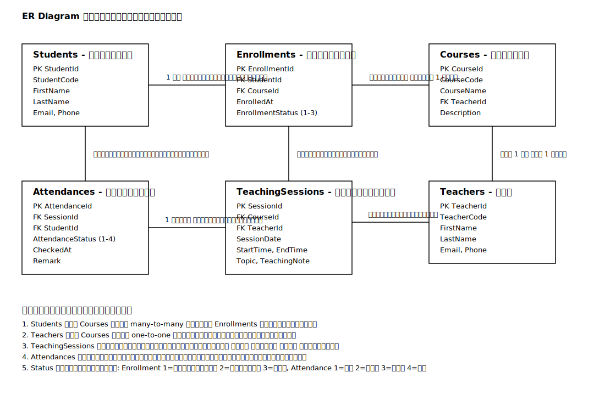

# Database ER Diagram



```mermaid
erDiagram
    STUDENTS ||--o{ ENROLLMENTS : enrolls
    COURSES ||--o{ ENROLLMENTS : has
    TEACHERS ||--|| COURSES : teaches
    COURSES ||--o{ TEACHING_SESSIONS : has
    TEACHERS ||--o{ TEACHING_SESSIONS : teaches
    TEACHING_SESSIONS ||--o{ ATTENDANCES : records
    STUDENTS ||--o{ ATTENDANCES : attends

    STUDENTS {
        int StudentId PK
        varchar StudentCode UK
        nvarchar FirstName
        nvarchar LastName
        varchar Email
        varchar Phone
        datetime CreatedAt
    }

    TEACHERS {
        int TeacherId PK
        varchar TeacherCode UK
        nvarchar FirstName
        nvarchar LastName
        varchar Email
        varchar Phone
        datetime CreatedAt
    }

    COURSES {
        int CourseId PK
        varchar CourseCode UK
        nvarchar CourseName
        nvarchar Description
        int TeacherId FK_UK
        datetime CreatedAt
    }

    ENROLLMENTS {
        int EnrollmentId PK
        int StudentId FK
        int CourseId FK
        datetime EnrolledAt
        tinyint EnrollmentStatus
    }

    TEACHING_SESSIONS {
        int SessionId PK
        int CourseId FK
        int TeacherId FK
        date SessionDate
        time StartTime
        time EndTime
        nvarchar Topic
        nvarchar TeachingNote
    }

    ATTENDANCES {
        int AttendanceId PK
        int SessionId FK
        int StudentId FK
        tinyint AttendanceStatus
        datetime CheckedAt
        nvarchar Remark
    }
```

## Design Notes

- `Students` and `Courses` are many-to-many, so `Enrollments` is the junction table.
- `Teachers` and `Courses` are one-to-one by making `Courses.TeacherId` both FK and unique.
- `TeachingSessions` stores each teaching event for a course.
- `Attendances` stores each student's attendance per teaching session.
- Useful unique constraints:
  - `Enrollments(StudentId, CourseId)`
  - `Attendances(SessionId, StudentId)`
  - `Courses(TeacherId)`
